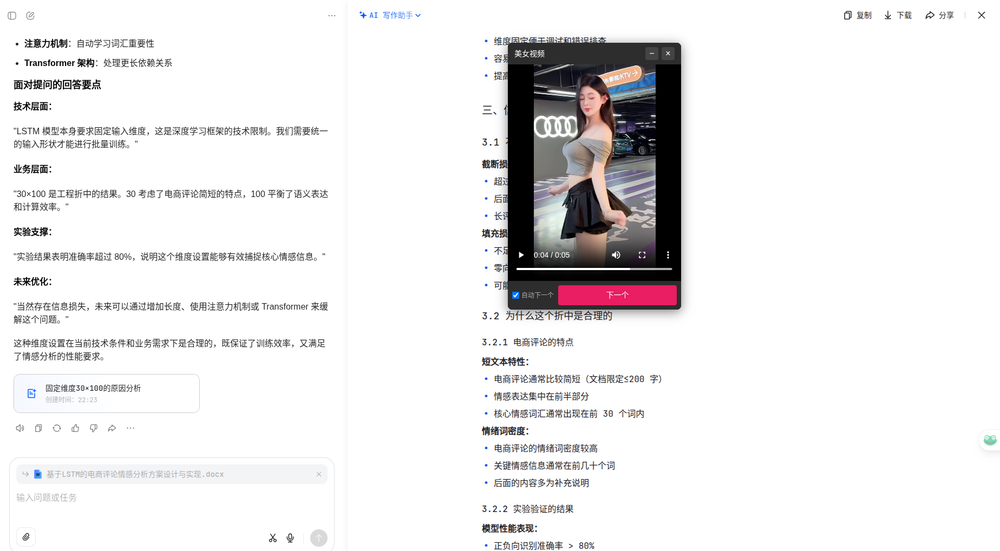

# video-player

一个基于 **Tauri 2** 的随机视频/美图播放器，并附带一个 **Manifest V3** 的 Chrome 悬浮窗扩展：在任意网页一键弹出可拖拽浮窗，随用随关。

- 项目地址：`https://github.com/1776686596/video-player`
- 推荐：优先使用浏览器插件（更轻量、更顺手）；桌面端更适合当独立播放器使用（带接口/缓存管理与预加载兜底）

> 备注：项目中部分 UI 文案沿用演示名（如“美女视频”），本质是“可配置接口的播放器壳子”，替换为任意你有权限使用的视频/图片接口即可。

## 预览

Chrome 扩展悬浮窗效果：



## 功能

### Chrome 悬浮窗扩展（推荐）

- 点击扩展图标开关悬浮窗
- 支持拖拽、最小化、关闭
- 支持自动下一个 / 手动下一个

### 桌面端（Tauri）

- 视频播放：播放/暂停、进度、音量、倍速、全屏
- 自动下一个：视频结束自动切换
- 预加载：后台提前下载下一条，减少等待
- 接口管理：按分类切换/随机、支持新增/删除自定义接口
- 缓存管理：清理当前播放状态与预加载队列
- 美图模式：随机图片浏览（同样支持分类/接口配置）

## 安装与使用

### 安装 Chrome 扩展（开发者模式）

1. 下载/克隆仓库：`https://github.com/1776686596/video-player`（或直接使用 `chrome-extension.zip`）
2. 打开 `chrome://extensions/`
3. 开启右上角「开发者模式」
4. 点击「加载已解压的扩展程序」，选择 `chrome-extension/` 目录
5. 打开任意网页，点击扩展图标，即可在页面右下角显示浮窗

提示：`chrome://`、`edge://` 等内置页面无法注入脚本，属于浏览器限制。

### 运行桌面端（Tauri）

环境要求：

- Node.js（建议 >= 18）
- Rust toolchain（`rustup`）
- Tauri 2 所需系统依赖（按你的系统安装）

启动开发：

```bash
npm install
npm run dev
```

打包：

```bash
npm run build
```

## 接口配置

桌面端点击右上角 `⚙` 进入设置面板，可进行：

- 切换分类 / 随机模式
- 添加/删除自定义接口与分类
- 清理缓存与预加载队列

## 项目结构

```text
video-player/
├── src/                # 前端（原生 HTML/JS/CSS）
├── src-tauri/          # Tauri 2 / Rust 后端
├── chrome-extension/   # Chrome 扩展（MV3）
├── chrome-extension.zip
└── short/              # 截图/演示
```

## 说明

- Chrome 扩展会在当前标签页注入脚本并请求网络资源，具体权限见 `chrome-extension/manifest.json`。
- 本项目默认内置了一些第三方示例接口；建议在发布/分发前替换为你有权限使用、且稳定可控的接口。

## 免责声明

本项目仅用于学习与交流。请在使用与二次分发时遵守法律法规、版权与接口方使用条款，并自行评估接口稳定性与安全性。
